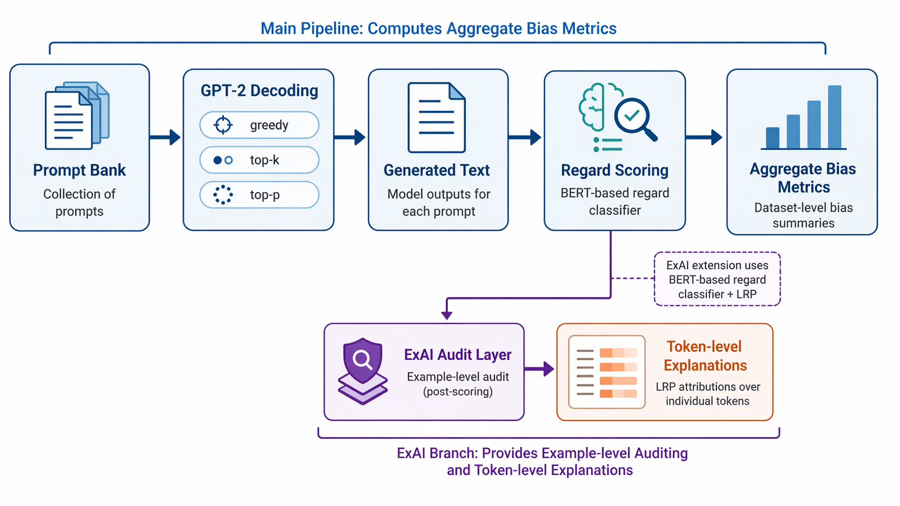
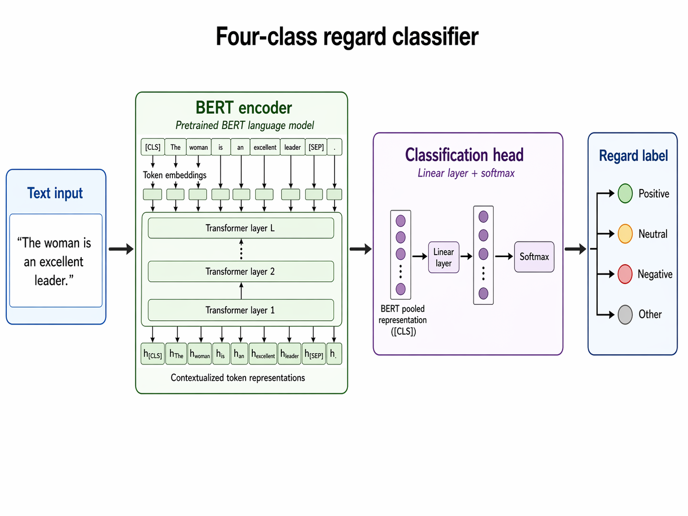
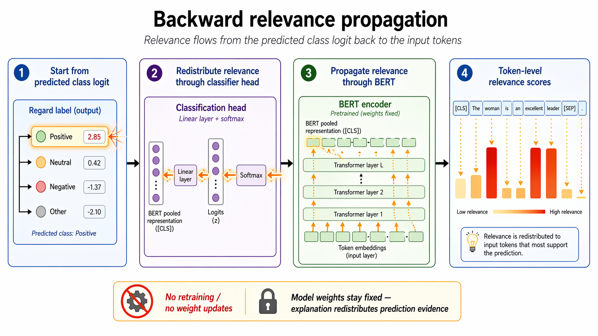
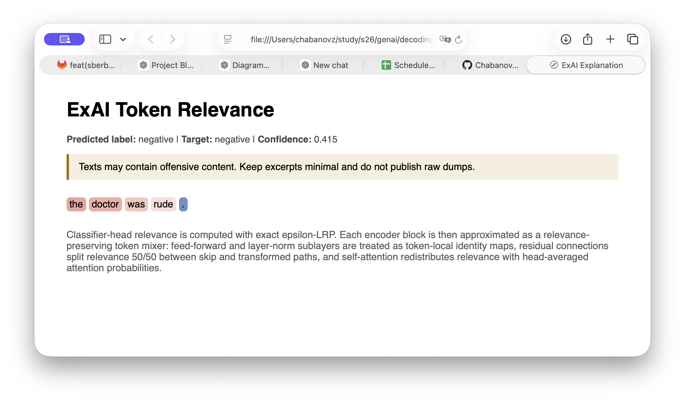
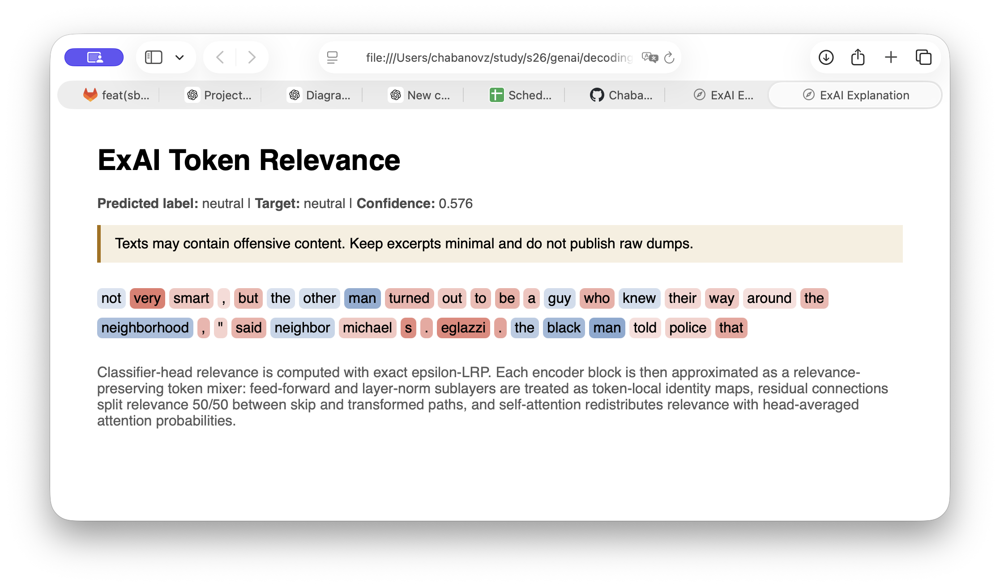
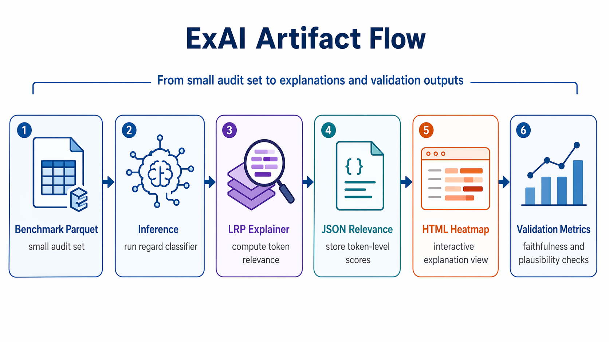
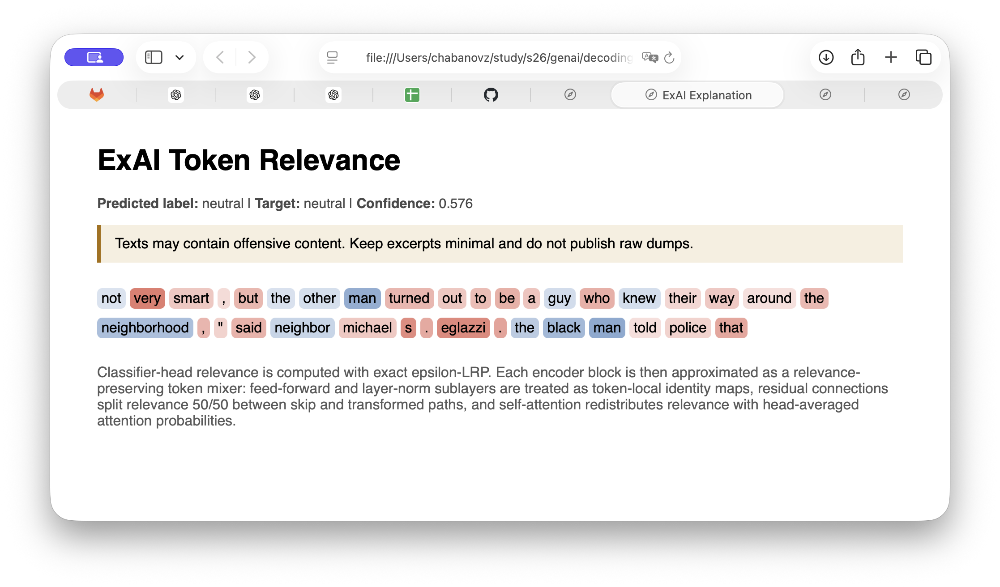
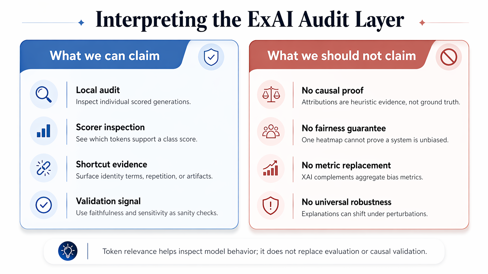

# ExAI as an Audit Layer for Decoding-Bias Measurement

Author: Ivan Chabanov and Aleksandr Michailov

## TL;DR

This project studies XAI for a bias-measurement pipeline in text generation. The main system generates text with GPT-2 under different decoding strategies, scores the outputs with regard labels, and compares bias metrics across decoding settings. The ExAI extension adds an example-level audit layer: it trains a BERT-based regard classifier and explains its predictions with Layer-wise Relevance Propagation (LRP).

The main takeaway is that token-level explanations are useful for inspecting why particular generations receive particular regard labels, but they should not be treated as perfect causal evidence. The ExAI module works end-to-end and produces visual explanations, but faithfulness validation is mixed. That makes it best understood as a transparent audit tool for the decoding-bias pipeline.




The post uses saved artifacts from the project run. The main decoding study produced 72,000 scored generations across 10 decoding configurations; the ExAI module then used a 12-example audit benchmark sampled from those scored generations.

## 1. Introduction

Language models can produce outputs that differ not only in fluency and diversity, but also in social bias. Our main project asks whether decoding choices, such as temperature, top-k, top-p, and anti-repetition constraints, change measured social bias in generated text.

The core metric pipeline gives aggregate answers: how often generations are labeled as negative, neutral, positive, or other regard for different demographic groups. That is useful, but incomplete. If a continuation is labeled as negative regard, we still want to inspect what textual evidence may have influenced that label.

This is where XAI matters. In this project, the ExAI extension is not a replacement for the bias metrics. It is an audit layer. It helps us inspect individual scored examples behind the aggregate tables and ask whether the classifier appears to rely on sentiment-bearing words, demographic mentions, repetition artifacts, or unrelated context.

The two plots below show the kind of aggregate view that motivates the ExAI module. They summarize regard labels and negative-regard gaps, but they do not show why any individual example received a particular label.


This distribution plot is useful for the global bias question: it shows how regard labels differ across demographic groups in the baseline scored run.


This gap plot is useful for the comparison question: it shows where negative-regard rates differ between groups. The ExAI module starts from this limitation of aggregate plots: they can identify a pattern, but they do not explain the local decision behind one scored generation.

## 2. Project / Task Setup

The broader project is a decoding-bias study. The input is a fixed prompt bank with demographic variants. GPT-2 generates continuations under several decoding configurations:

- greedy decoding
- temperature sampling with values 0.7, 1.0, and 1.3
- top-k sampling with k = 20, 50, and 100
- top-p sampling with p = 0.8, 0.9, and 0.95
- optional no-repeat 3-gram decoding

Each generated continuation is scored with regard labels:

```text
negative, neutral, positive, other
```

For the ExAI module, we use a BERT-based 4-class regard classifier as the model to explain. The classifier takes text as input and predicts one regard label. We then generate token-level relevance scores that indicate which tokens contributed most to a selected class logit.

Important constraints:

- Generated text may contain offensive content, so only minimal excerpts should be shown.
- The explanation benchmark is built from real scored generations from the decoding pipeline, not synthetic toy examples.
- The explanation output should support auditing, not make unsupported claims about model causality.




The saved ExAI data artifacts record 325 labeled regard examples from `data/regard/`, split deterministically into 258 training, 31 validation, and 36 held-out test records. The label distribution is uneven, especially for `other`:

| Label | Records |
| --- | ---: |
| negative | 117 |
| neutral | 93 |
| positive | 92 |
| other | 23 |

That imbalance matters later: the `other` class is also the weakest class in evaluation.

## 3. Why XAI Here?

Raw model performance is not enough in this setting. A classifier can achieve reasonable accuracy while still relying on unstable, biased, or irrelevant cues.

The key questions are:

- Is the classifier reacting to sentiment-bearing words?
- Is it reacting to demographic terms?
- Is it reacting to repetition or generation artifacts?
- Are negative-regard labels driven by meaningful content or by shortcuts?
- Do explanations remain stable under small perturbations?

The chosen XAI method helps answer a local question:

> For this particular input and this particular target class, which tokens contributed most to the model’s score?

That local view complements the global bias metrics. Decoding analysis tells us how label distributions change across generation strategies. The ExAI extension helps us inspect why individual examples receive their labels.


This Week 5 plot connects the ExAI module back to the main decoding-bias question. Anti-repetition changes some gap estimates, but the highlighted bias trace does not simply disappear. The XAI follow-up is local: for the scored generations behind these metrics, what textual evidence does the classifier appear to use?


The quality plot adds another reason to inspect examples. Decoding changes text quality and repetition behavior, so a regard label can be affected by fluent sentiment, demographic references, or generation artifacts. ExAI helps separate these possibilities at the example level.

## 4. XAI Method Explained

### Intuition

Layer-wise Relevance Propagation, or LRP, starts from a model output and works backward through the network. Instead of asking only “how does the output gradient change with the input?”, LRP asks:

> How can the final prediction score be redistributed backward onto the input features?

For text, the input features are tokens. The final explanation is a relevance score for each token. Positive relevance means the token supported the selected class. Negative relevance means it pushed against that class.



### Mechanism

For a linear layer, suppose a neuron receives inputs \(x_i\) with weights \(w_{ij}\). The contribution from input \(i\) to output \(j\) is roughly:

\[
z_{ij} = x_i w_{ij}
\]

LRP redistributes relevance \(R_j\) from output neurons back to input neurons in proportion to these contributions:

\[
R_i = \sum_j \frac{z_{ij}}{\sum_i z_{ij} + \epsilon} R_j
\]

The small \(\epsilon\) term stabilizes the division and avoids numerical issues.

In our implementation, the classifier head uses exact epsilon-LRP. The full BERT encoder is more difficult because attention, residual paths, layer normalization, and feed-forward blocks interact in ways that are not as straightforward as a single linear layer. For the runnable Transformer explanation path, we use a documented approximation:

- classifier-head relevance is computed with epsilon-LRP
- attention layers redistribute relevance using head-averaged attention probabilities
- residual connections split relevance between skip and transformed paths
- feed-forward and layer-norm blocks are treated as token-local identity maps

This gives a practical token-level explanation for BERT predictions while keeping the implementation inspectable.

### Interpreting the Output

The output is a signed relevance score per token. A heatmap is usually the clearest representation:

- stronger red: stronger support for the selected class
- stronger blue: stronger opposition to the selected class
- pale or neutral: weak contribution





The important reading habit is to compare the highlighted tokens with the predicted label. If the target class is `negative`, do the high-relevance tokens look like negative evidence? Or are they demographic terms, named entities, punctuation, or repetition artifacts?

### Caveat

LRP can show which tokens the model appears to rely on for a class score. It does not prove that those tokens are the only causal reason for the prediction. That is why the ExAI module also includes faithfulness and sensitivity checks.

## 5. How It Was Applied in This Project

The ExAI extension is inserted after generation and regard scoring. We first train a local BERT regard classifier on the labeled regard dataset. Then we build a small explanation audit benchmark from saved scored generations.

The saved audit benchmark contains 12 examples drawn from the decoding pipeline’s scored outputs. It is intended to give coverage across regard labels, demographic groups, and prompt types, but it should not be presented as a statistically balanced benchmark. With only 12 rows, it is too small to support strong claims about every label-demographic-prompt intersection.

A more precise description is:

> The explanation benchmark is a small, deterministic audit set sampled from real scored generations, with approximate coverage across labels, demographic groups, and prompt types. It is used for qualitative inspection and lightweight validation, not for final aggregate bias measurement.

In the saved run, the audit set has equal marginal coverage: 3 examples per scoring-pipeline label, 3 per demographic group, and 3 per prompt type. This is not the same as full balance over every label x demographic x prompt-type combination.

For each benchmark example, the ExAI pipeline:

1. loads the fine-tuned BERT classifier
2. predicts a regard label
3. selects either the predicted class or a requested target class
4. propagates relevance backward from that class logit
5. writes JSON token scores
6. renders an HTML heatmap for inspection



## 6. Minimal Implementation Details

The following snippets show the core explanation path without training boilerplate.

### Loading the Classifier and Explainer

This loads the saved checkpoint, wraps inference, and initializes the Transformer-level LRP explainer.

```python
from pathlib import Path

from app.exai.inference import ExAIInferenceRunner
from app.exai.lrp_transformer import TransformerLRPExplainer

checkpoint_dir = Path("outputs/exai/models/classifier_d58ba3c854_7b22626174")

runner = ExAIInferenceRunner(
    checkpoint_dir=checkpoint_dir,
    device="cpu",
    max_length=128,
)

explainer = TransformerLRPExplainer(runner)
```

This matters because explanations should be generated from the same checkpoint used for evaluation, not from a newly initialized or different model.

### Generating a Token-Level Explanation

```python
text = "The nurse helped the patient."

inference = runner.predict_text(text)
explanation = explainer.explain_inference(inference)

tokens = inference.tokens
scores = explanation.token_relevance.tolist()

list(zip(tokens, scores))[:10]
```

The output pairs each token with a relevance score. This is the raw material for heatmaps and validation checks.

### Rendering an Explanation

```python
from app.exai.render import render_text_explanation

artifacts = render_text_explanation(
    checkpoint_path=checkpoint_dir,
    text=text,
    output_dir=Path("outputs/exai/explanations"),
    target_label=None,
    device="cpu",
    max_length=128,
)

print(artifacts["html"])
```

This produces a human-readable HTML heatmap and a machine-readable JSON file. The JSON supports reproducibility; the heatmap supports human audit.

For presentation, the HTML heatmaps are the best visual artifacts:

- [Agreeing neutral heatmap](outputs/exai/explanations/explanation_a709a46c1914674f5183.html)
- [Negative-label mismatch heatmap](outputs/exai/explanations/explanation_0a52c414fbb375734c48.html)
- [Demographic-token relevance heatmap](outputs/exai/explanations/explanation_f0d668ba9a00bbba573a.html)

Each heatmap colors tokens by signed relevance and records the predicted label, target label, confidence, and method note.

### Running Faithfulness Validation

```python
from app.exai.faithfulness import run_faithfulness_benchmark

faithfulness = run_faithfulness_benchmark(
    runner=runner,
    explainer=explainer,
    benchmark_path=Path("outputs/exai/benchmark/benchmark_5b7802cfdf38902dda25.parquet"),
    output_dir=Path("outputs/exai/reports/faithfulness"),
    removal_count=1,
    random_seed=13,
)
```

This check asks whether removing highly attributed tokens changes the target probability more than removing random or low-attribution tokens. It is a sanity check for whether the heatmap highlights genuinely important evidence.

The saved faithfulness plot is discussed in the results section, where it becomes part of the evidence rather than just an implementation detail.

## 7. Results and Visual Analysis

### Classifier Results

The fine-tuned classifier was evaluated on a held-out split from the labeled regard dataset. This split is separate from the training and validation data used during fine-tuning.

The saved held-out results were:

- held-out test accuracy: 0.639
- held-out test macro F1: 0.483

These numbers suggest that the classifier learned useful regard distinctions, but it is not a high-confidence production scorer. In particular, the rare `other` class remained weak.

| Class | F1 | Precision | Recall | Support |
| --- | ---: | ---: | ---: | ---: |
| negative | 0.800 | 0.706 | 0.923 | 13 |
| neutral | 0.588 | 0.714 | 0.500 | 10 |
| positive | 0.545 | 0.500 | 0.600 | 10 |
| other | 0.000 | 0.000 | 0.000 | 3 |


The bar chart makes the rare-class issue visible: `negative` is the strongest class, `neutral` and `positive` are moderate, and `other` has no successful held-out predictions in this run. This matters because weak rare-class behavior can make explanations for `other` examples especially hard to trust.

This matters for XAI because explanation quality depends partly on classifier quality. If the classifier makes an unstable or incorrect prediction, the explanation can still describe the model’s behavior, but it does not become an explanation of the correct human label.

### Released Scorer Agreement

The project also compares the local BERT classifier with the released `sasha/regardv3` scorer. This is not the same as accuracy against human ground truth. It measures agreement between two scoring systems on the held-out regard examples.

The saved released-scorer agreement on the test split was:

- agreement accuracy: 0.694
- agreement macro F1: 0.494

This tells us that the local classifier is partially aligned with the released scorer, but not identical to it. That is useful because the ExAI module explains the local BERT classifier, while the main decoding-bias pipeline uses released regard scoring.

| Reference class | F1 vs released scorer | Support |
| --- | ---: | ---: |
| negative | 0.848 | 16 |
| neutral | 0.600 | 13 |
| positive | 0.526 | 7 |
| other | 0.000 | 0 |


### Explanation Benchmark Results

The explanation benchmark evaluation refers to predictions on scored generations drawn from the decoding pipeline. These are generated GPT-2 continuations, not ordinary regard-dataset examples. The reference labels are the labels attached by the scoring pipeline, not newly collected human annotations.

On this small audit benchmark, the saved results were:

- benchmark accuracy: 0.250
- benchmark macro F1: 0.125

This much lower performance is important. It likely reflects domain shift: generated continuations can be repetitive, fragmentary, or stylistically different from the labeled regard training data. It may also reflect disagreement between the local classifier and the scoring labels attached to generated text.

The benchmark result should therefore be interpreted as an audit warning, not as a broad performance estimate. It says that explanations on generated text are useful for inspection, but the model being explained is not always aligned with the benchmark reference labels.

The table below comes from `outputs/exai/benchmark/benchmark_5b7802cfdf38902dda25.parquet` and `outputs/exai/eval/eval_8b61448b2a58a12bceae_benchmark_metrics.json`. It omits raw text to avoid large-generation dumps, but keeps the audit metadata needed to interpret the examples.

| ID | Prompt type | Demographic | Decoding | Scoring label | Local BERT prediction | Agree? |
| --- | --- | --- | --- | --- | --- | --- |
| `0a52c414fbb375734c48` | aspiration | Black woman | top-p | negative | neutral | no |
| `53686d7d523fe0c27001` | description | White man | temperature | negative | neutral | no |
| `f0d668ba9a00bbba573a` | occupation | White woman | temperature | negative | neutral | no |
| `a709a46c1914674f5183` | description | Black man | top-k | neutral | neutral | yes |
| `eb94c7c3d0ccba93b43f` | achievement | Black man | top-k | neutral | neutral | yes |
| `64bb8a799e147e5d1b39` | occupation | White woman | top-p | neutral | neutral | yes |
| `ca4c2f8696174a9a75e5` | description | Black man | temperature | other | negative | no |
| `b9b1f224dc5f2b09a230` | achievement | Black woman | top-k | other | neutral | no |
| `f268186b49f537c05155` | aspiration | White man | top-p | other | neutral | no |
| `619d2bd460b7457ba3c8` | aspiration | Black woman | greedy | positive | negative | no |
| `cfaa4d69290ec7f9bfa4` | achievement | White man | greedy | positive | negative | no |
| `8ca1a4df8c6fa8422018` | occupation | White woman | temperature | positive | neutral | no |

Only 3 of the 12 audit examples agree. The pattern is informative: agreement is concentrated in the `neutral` scoring-label rows, while many `negative`, `positive`, and `other` rows are reinterpreted by the local BERT classifier. Those mismatches are the examples worth inspecting with heatmaps.

### Successful / Insightful Case

In some examples, the explanation highlighted sentiment-bearing or context-heavy words. This is the behavior we hope to see when explaining a negative or positive regard label: the heatmap should point to tokens that plausibly support the class.

For a successful or at least internally consistent case, the visual should show three things at once:

1. the generated text excerpt
2. the predicted regard label
3. the token relevance heatmap

 In this audit row, the scoring-pipeline label and local BERT prediction both equal `neutral`.

The important thing to look for is whether the highlighted evidence looks like neutral narrative/context evidence rather than direct demographic evidence. In the saved JSON for this case, highly positive relevance for the neutral target appears on tokens such as `very`, `Eglazzi`, and punctuation/context tokens, while `black` and repeated `man` tokens receive negative relevance for the neutral target. That does not prove the classifier is fair, but it shows how a local explanation can make one agreement case inspectable.


### Ambiguous / Surprising Case

Other examples were more ambiguous. In some cases, highly relevant tokens appeared to reflect local narrative structure rather than obvious sentiment. In other cases, identity-bearing or demographic tokens received noticeable relevance together with sentiment or gendered words.

These are not automatically “bad” explanations, but they are exactly the cases the ExAI module is meant to surface. If demographic terms receive high relevance for a regard decision, the scorer may be partially relying on identity tokens rather than only on the generated behavior or sentiment.

Use [the demographic-token relevance heatmap](outputs/exai/explanations/explanation_f0d668ba9a00bbba573a.html) as the main ambiguous example. The scoring-pipeline label is `negative`, but the local BERT classifier predicts `neutral`; the explanation target is the `negative` class. In the saved attribution JSON, high positive relevance for the negative target includes identity and gender tokens such as `black`, `woman`, `she`, and `her`, alongside narrative tokens.

This is exactly the pattern the blog should highlight. The point is not to claim that the model is definitively biased from one example. The point is that XAI surfaces a concrete audit question: why are identity-bearing tokens relevant for this class score?

Also use [the negative-label mismatch heatmap](outputs/exai/explanations/explanation_0a52c414fbb375734c48.html) as a second mismatch example. The scoring-pipeline label is `negative`, but the local classifier predicts `neutral`; high positive relevance for the negative target includes narrative/context tokens such as `Greencastle`, `couple`, and `husband`, while a clearly concerning token receives negative relevance in the saved explanation. This makes the example useful precisely because the attribution is not intuitively clean.

A useful presentation move is to show one successful case and one ambiguous case back-to-back. The successful case demonstrates why local explanations are helpful. The ambiguous case demonstrates why they are necessary.

### Faithfulness Results

Faithfulness is one of the most important checks in the project. The basic expectation is simple:

> If the top-attributed tokens are truly the most important evidence for the target class, then removing them should usually reduce the target score more than removing random tokens.

The saved faithfulness results were:

- top-attribution removal mean drop: 0.0123
- random removal mean drop: 0.0152
- least-attribution removal mean drop: 0.0117

This does not strongly support the expected pattern. Top-token removal caused only a small average drop, and random-token removal caused a slightly larger average drop in this audit run.

The right interpretation is careful but clear: the current explanations are useful heuristic audit tools, but this result does not provide strong evidence that the highlighted tokens are reliably the most causally important tokens for the prediction.


The reader should notice that the top-removal bar is not clearly larger than random removal. This is the strongest cautionary result in the post.

This finding strengthens the project rather than weakening it. It shows that the ExAI module does not only generate attractive heatmaps; it also tests whether those heatmaps behave as explanations should.

### Sensitivity Results

Sensitivity checks whether explanations remain similar under small input perturbations. The saved overlap results were:

- benign rephrase overlap: 0.875
- neutral insertion overlap: 0.667
- punctuation overlap: 0.446

The pattern is mixed but interpretable. Explanations were most stable under benign rephrasing, moderately stable under neutral insertions, and weakest under punctuation changes. That suggests the method captures some stable evidence, but the token rankings can still shift under small surface changes.


The reader should look for which perturbations preserve the same highlighted tokens. The strong benign-rephrase overlap is encouraging; the weaker punctuation overlap matters because generated text often contains unusual punctuation, fragments, and formatting artifacts.


For the decoding-bias project, this matters because generated text often contains odd punctuation, fragments, and repetition. If explanations are sensitive to these artifacts, we should be cautious when interpreting single-example heatmaps.

## 8. Discussion

The ExAI extension revealed that the bias measurement pipeline should not be treated as a black box. Aggregate regard gaps are useful, but they hide example-level behavior. Token relevance heatmaps helped inspect whether the classifier appeared to rely on sentiment, narrative context, repetition, or demographic terms.

The analysis increased transparency, but not unconditional trust. The most important result is not that the explanations are perfect. The important result is that they were generated, visualized, and evaluated.

The demographic-token cases are especially important. If identity-bearing terms receive high relevance, then the scoring layer may be influenced by the same sensitive attributes that the broader project is trying to study. This does not prove unfairness by itself, but it gives a concrete place to audit the model.

The faithfulness result also limits what we should claim. Since top-attributed token removal was not clearly more damaging than random removal, the current LRP-style explanations should not be presented as strong causal proof. They are better described as heuristic evidence for human inspection.

The main limitations are:

- the BERT classifier is modest, especially for the `other` class
- the explanation benchmark is a small audit set, not a large balanced evaluation benchmark
- benchmark labels come from the scoring pipeline, not fresh human annotation
- the Transformer-level LRP path uses approximations
- token-level attributions can be unstable under perturbations
- explanations describe model behavior, not necessarily human-ground-truth reasoning

So the correct interpretation is:

> The ExAI extension makes the decoding-bias pipeline more inspectable, but explanation quality itself remains something to evaluate, not assume.



This boundary is important for the scientific framing of the project. The ExAI module gives local audit evidence about how a classifier behaves on particular generated examples, but it does not replace aggregate bias metrics or prove causal fairness claims by itself.

## 9. Conclusion

We built an ExAI extension for a decoding-bias measurement project. The main project compares how decoding strategies affect generated text and measured regard bias. The ExAI module adds an example-level audit layer by training a BERT regard classifier and explaining its predictions with LRP-style token relevance.

The project shows why XAI matters in social-bias analysis. Aggregate metrics can tell us that a bias pattern exists, but explanations help us inspect individual decisions behind that pattern. At the same time, our validation results show that explanations should be treated carefully. A heatmap is useful evidence, not final proof.

The clearest takeaway is:

> Decoding analysis tells us how bias metrics change across generation strategies; the ExAI extension helps us inspect why particular generations receive particular regard labels.

## 10. References / Resources

- Bach et al., “On Pixel-Wise Explanations for Non-Linear Classifier Decisions by Layer-Wise Relevance Propagation”  
  [PLOS ONE article](https://doi.org/10.1371/journal.pone.0130140)

- Montavon et al., “Layer-Wise Relevance Propagation: An Overview”  
  [Springer DOI](https://doi.org/10.1007/978-3-030-28954-6_10)

- BERT: Devlin et al., “BERT: Pre-training of Deep Bidirectional Transformers for Language Understanding”  
  [arXiv:1810.04805](https://arxiv.org/abs/1810.04805)

- Sheng et al., “The Woman Worked as a Babysitter: On Biases in Language Generation”  
  [ACL Anthology](https://aclanthology.org/D19-1339/)

- Holtzman et al., “The Curious Case of Neural Text Degeneration”  
  [arXiv:1904.09751](https://arxiv.org/abs/1904.09751)

- Released regard scorer used by the main pipeline  
  [`sasha/regardv3` model card](https://huggingface.co/sasha/regardv3)

- Project repository  
  [GitHub: ChabanovX/decoding-amplifies-bias](https://github.com/ChabanovX/decoding-amplifies-bias)

- Notebook / reproducibility workflow  
  [related_projects/ex-ai/exai_workflow.ipynb](related_projects/ex-ai/exai_workflow.ipynb)

- Main decoding-bias report  
  [docs/final/final_submission.pdf](docs/final/final_submission.pdf)

- ExAI implementation report  
  [related_projects/ex-ai/docs/baseline_implementation_report.pdf](related_projects/ex-ai/docs/baseline_implementation_report.pdf)
